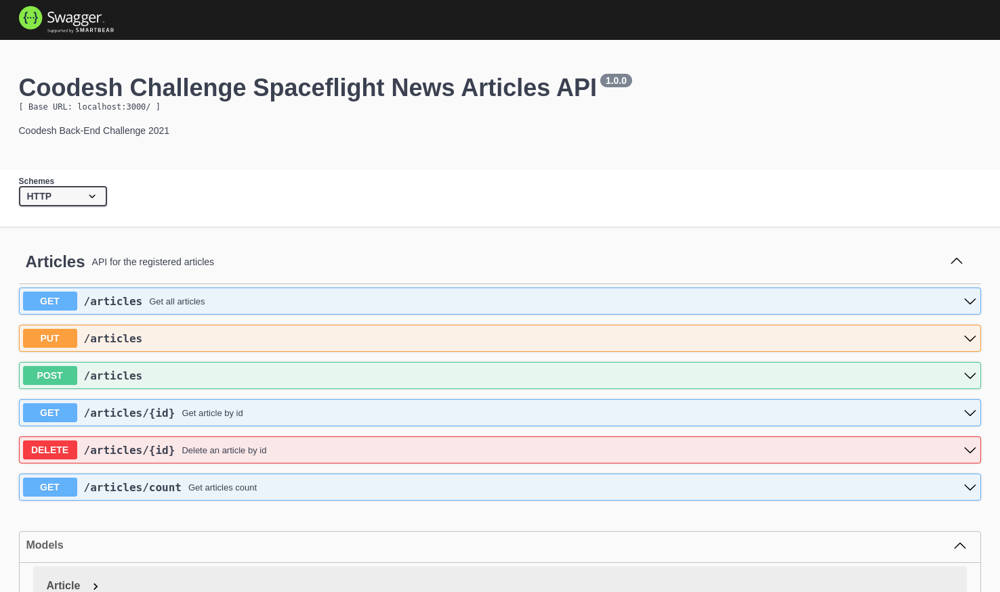

## **Back-end Challenge 🏅 2021 - Space Flight News**

This is a challenge by [Coodesh](https://coodesh.com/)

Projeto realizado por Marcello Fabrizio

Menu:

- [**Back-end Challenge 🏅 2021 - Space Flight News**](#back-end-challenge--2021---space-flight-news)
- [Descrição](#descrição)
- [Frameworks e Tecnologias](#frameworks-e-tecnologias)
- [Instalação](#instalação)

## Descrição
 

 
 

O projeto seguiu os requisitos levantados pelo enunciado do problema. Deveria ser construída uma API para acesso de artigos do projeto [Space Flight News](https://api.spaceflightnewsapi.net/v3/documentation). O projeto possui seis end-points, nos quais é possível se obter os artigos armazenados em um banco de dados. Além disso, existe um sétimo end-point, o qual retorna a mensagem "Back-end Challenge 🏅 2021 - Space Flight News". A documentação pode ser acessada pela rota /documentation.
 

## Frameworks e Tecnologias
- NodeJS como ambiente JavaScript
- MongoDB para banco de dados
- Docker para virtualização
- Express para lidar com as requisições
- Swagger para documentação da API

 

## Instalação

A instalação dos pacotes deve ser feita pelo comando

`npm install`

Como a aplicação foi virtualizada com Docker, basta executar o comando 

`docker-compose up`

Assim, a aplicação estará rodando no localhost.

Para o script sincronizador de arquivos, se deve rodar o comando

`npm run cron`
